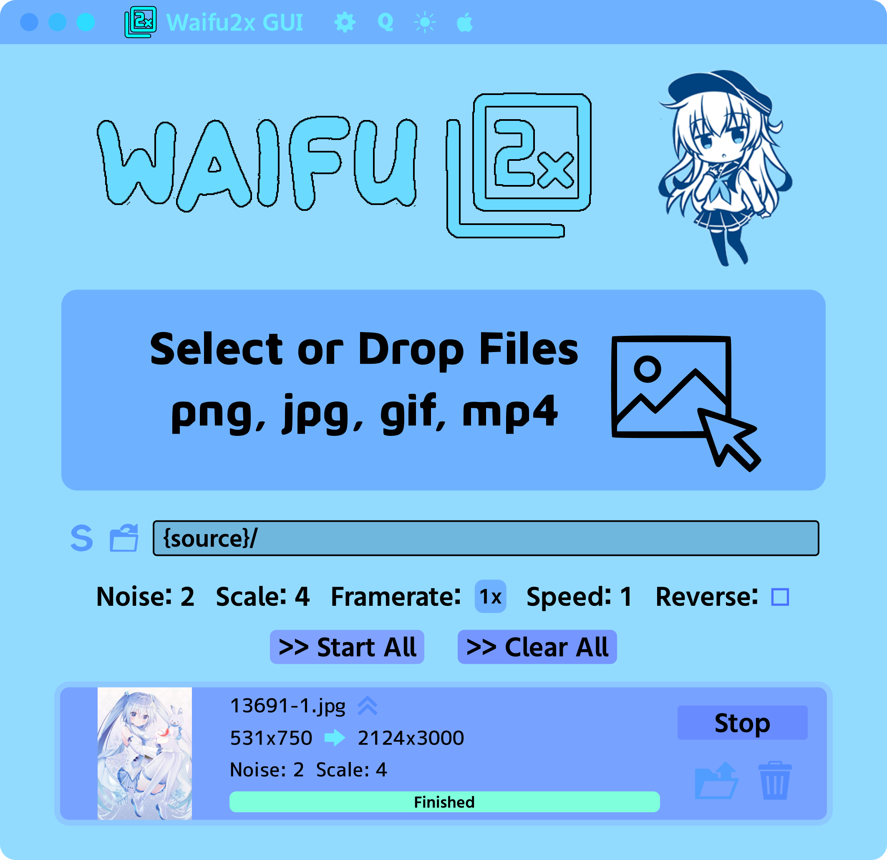

## Waifu2x Upscaler



This is an app that can upscale anime images, gifs, and videos using waifu2x, Real-ESRGAN, or Real-CUGAN. It aims to be simple to use. 

Note: Upscaling videos and gifs will take a very long time without a high-end graphics card.

### Features:
- Upscale and/or denoise images (png, jpg, webp, etc.)
- Upscale and/or denoise animated images (gif, animated webp)
- Upscale and/or denoise videos (mp4, webm, ogv, etc.)
- Upscale and/or denoise PDFs (pdf)
- Apply effects such as speed or reverse (animated images/videos)
- Customize settings (noise, scale, mode, framerate, etc.)
- Upscale multiple images (or multiple frames of an animated image/video) concurrently
- Change the upscaler (waifu2x, Real-ESRGAN, Real-CUGAN, or custom)

Warning: Upscaling too many images in parallel can cause your computer to freeze if it runs out of CPU/memory.

### Waifu2x

Waifu2x only supports scale factors in multiples of 2 from 1/2/4 and noise level -1/0/1/2/3 (set to -1 for no denoise).

### Real-ESRGAN

Real-ESRGAN only supports scale factors between 2-4, and all other options are ignored. By setting the scale factor to 4x, it will use the slower Anime4x model that gives better results, so it is recommended to upscale images at 4x when using Real-ESRGAN.

### Real-CUGAN

Real-CUGAN only supports scale factors 1/2/3/4, and noise level -1/0/1/2/3 and only noise 0 and 3 for scale factors 3/4. This is probably the best performing upscaler out of the defaults.

### Custom Models

You can add custom pytorch models to the "models" folder in the location the app is installed, same place
ffmpeg folder is located. If the folder doesn't exist, create it. You need to install python in order to run them. If you 
still have trouble, try installing the dependencies:

```
pip3 install torch torchvision opencv-python Pillow numpy spandrel --compile --force-reinstall
```

### Design

Our design is available here: https://www.figma.com/design/KXFlnNiiqjK18WgVIqxaVu/Waifu2x-Upscaler

*New design is wip

### Installation

Download from [releases](https://github.com/Moebytes/Waifu2x-Upscaler/releases.

### MacOS

On MacOS unsigned applications won't open, run this to remove the quarantine flag.
```
xattr -d com.apple.quarantine "/Applications/Waifu2x Upscaler.app"
```

### Related/Credits

- [my waifu2x module](https://github.com/Moebytes/waifu2x)
- [waifu2x](https://github.com/nagadomi/waifu2x)
- [real-esrgan](https://github.com/xinntao/Real-ESRGAN)
- [real-cugan](https://github.com/bilibili/ailab)

